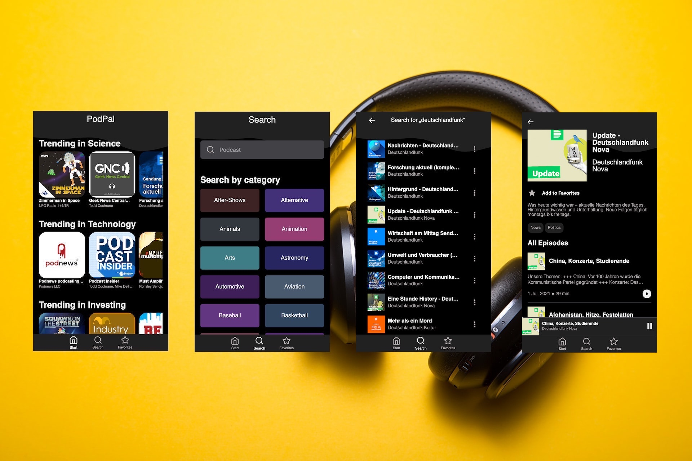

# PodPal

> Final project for neuefische web dev bootcamp

## `Description`

### An app for listening, finding and enjoying your favorite podcasts

This app gives you the opportunity to listen to your favorite podcasts.
It also alleviates the process of finding new inspiring ones.
You can search through the whole catalog by specific categories or specify your own search.
Enjoy each podcast with an easy to use audio player.

### `Demo`

You can find the hosted version on vercel:
This demo is optimized for mobile screens.
[Demo Version](https://capstone-project-one.vercel.app/)

## `Tech Stack`

- React
- React Hooks
- React Router
- Axios
- Vercel
  - Authentication
  - Serverless Functions
  - Hosting
- PropTypes
- Styled Components
- Storybook
- React Testing Library
- Jest
- Cypress Component Tests
- Recoil
- Node.js
- Web Audio Api

## `Project setup`

1. Clone this repository.
2. Install all npm dependencies

   `npm install`

3. To run the app in development mode npm start, then open http://localhost:3000 to view it in the browser
4. To run Storybook
   `npm run storybook`
5. To run unit and component tests
   `npm test`
6. To run Cypress tests
   `npm run cypress`
7. Create a build ready for deployment to firebase
   `npm run build`
